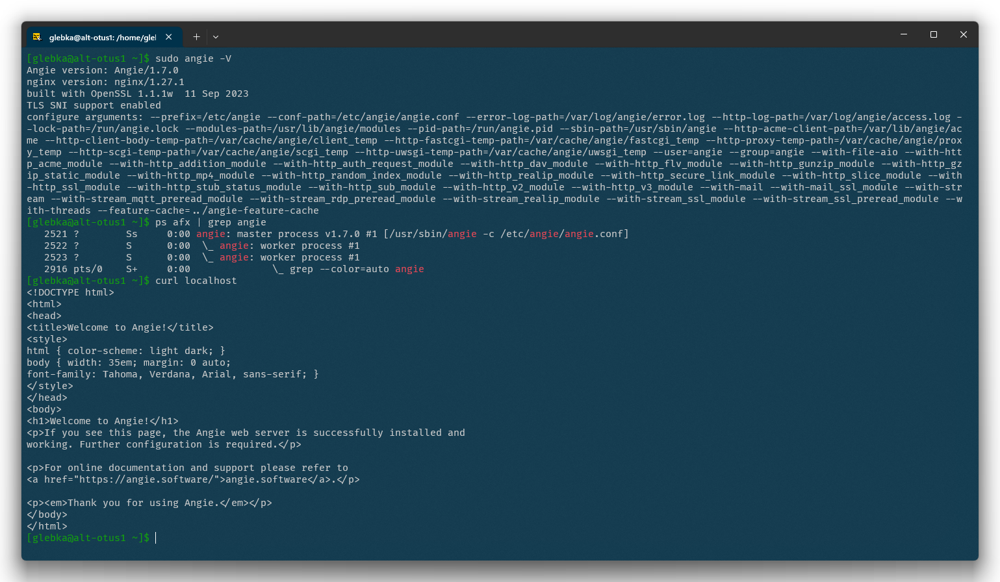

# Пакетная установка Angie

Для пакетной установки используем [документацию Angie](https://angie.software/angie/docs/installation/oss_packages/#install-alt-oss).

Создаём каталог `/etc/ssl/angie/`, куда будет помещён открытый ключ репозитория.

```bash
sudo mkdir -p /etc/ssl/angie/
```

Устанавливаем вспомогательные пакеты (выясняем, что последняя версии `curl` и `apt-https` уже установлены).

```bash
sudo apt-get update
sudo apt-get install -y curl apt-https
```

Скачиваем открытый ключ репозитория Angie:

```bash
sudo curl -o /etc/ssl/angie/angie-signing.gpg https://angie.software/keys/angie-signing.gpg
```

Импортируем ключ репозитория в цепочку доверенных ключей:

```bash
sudo gpg --no-default-keyring --keyring /usr/lib/alt-gpgkeys/pubring.gpg --import /etc/ssl/angie/angie-signing.gpg
```
Сохраняем сигнатуру ключа в файл `/etc/apt/vendors.list.d/angie.list`:

```bash
echo 'simple-key "angie" {
          Fingerprint "EB8EAF3D4EF1B1ECF34865A2617AB978CB849A76";
          Name "Angie (Signing Key) <devops@tech.wbsrv.ru>";
  }' | sudo tee /etc/apt/vendors.list.d/angie.list > /dev/null
```

Подключаем репозиторий (у нас Альт 10):

```bash
echo "rpm [angie] https://download.angie.software/angie/altlinux/10/ $(uname -m) main" | sudo tee /etc/apt/sources.list.d/angie.list > /dev/null
```

В результате получаем файл `/etc/apt/sources.list.d/angie.list` следующего содержания:

```txt
rpm [angie] https://download.angie.software/angie/altlinux/10/ x86_64 main
```

Устанавливаем Angie и необходимые пакеты (например, angie-console-light и angie-module-brotli):

```bash
sudo apt-get update
sudo apt-get install -y angie angie-console-light angie-module-brotli
```

Добавляем Angie в автозагрузку и запускаем:

```bash
sudo systemctl enable angie
sudo systemctl start angie
```

Проверим версию и параметры сборки Angie:

```bash
sudo angie -V
```

Посмотрим процессы Angie:

```bash
ps afx | grep angie
```

Проверим работу веб-сервера:

```bash
curl localhost
```



Angie установлен и успешно функционирует.
