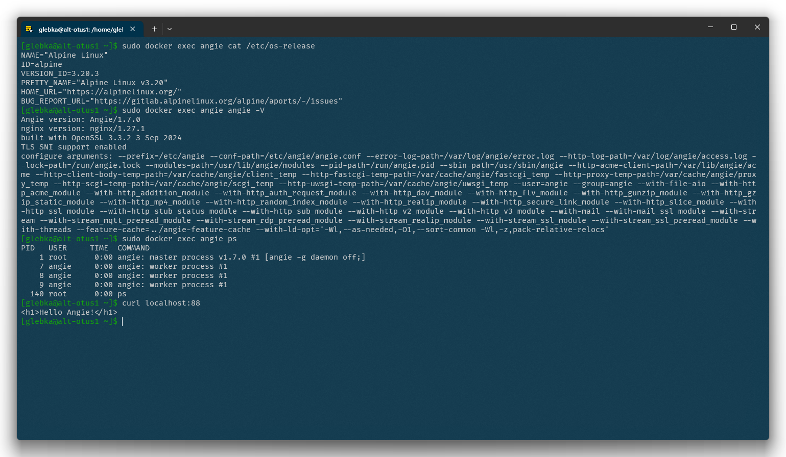

# Запуск Angie в Docker-контейнере

Устанавливаем Docker:

```bash
sudo apt-get install -y docker-io
```

Добавляем Docker в автозагрузку и запускаем:

```bash
sudo systemctl enable docker
sudo systemctl start docker
```

Скачиваем и запускаем контейнер Angie:

```bash
sudo docker run --name angie -d docker.angie.software/angie:latest
```

Копируем из контейнера `/etc/angie/` чтобы конфигрурация хранилась на локальной машине:

```bash
sudo docker cp angie:/etc/angie/ /home/glebka/angie
```

Удаляем контейнер:

```bash
sudo docker rm -f angie
```

И поднимаем новый, пробросив в контейнер локальные папки `/var/www/html` -> `/usr/share/angie/html` и `/home/glebka/angie` -> `/etc/angie` и порт `88` -> `80`:

```bash
sudo docker run --name angie -v /var/www/html:/usr/share/angie/html:ro -v /home/glebka/angie:/etc/angie:ro -p 88:80 -d docker.angie.software/angie:latest
```

Создадим файл `/var/www/html/index.html` следующего содержания:

```html
<h1>Hello Angie!</h2>
```

Посмотрим версию OC контейнера:

```bash
sudo docker exec angie cat /etc/os-release
```

Проверим версию и параметры сборки Angie:

```bash
sudo docker exec angie angie -V
```

Посмотрим процессы запущенные в контейнере:

```bash
sudo docker exec angie ps aux | grep angie
```

Проверим работу веб-сервера:

```bash
curl localhost:88
```



Angie в контейнере Docker запущен и успешно функционирует.
