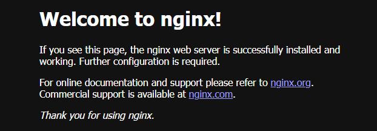

# Миграция из Nginx в Angie

Поскольку материалы для домашнего задания содержат конфигурацию типичную для Ubuntu, манипуляции производятся на виртуальной машине с ОС Ubuntu с установленным Nginx:

```
$ lsb_release -a
No LSB modules are available.
Distributor ID: Ubuntu
Description:    Ubuntu 24.04.1 LTS
Release:        24.04
Codename:       noble

$ nginx -v
nginx version: nginx/1.24.0 (Ubuntu)
```

## Подготовка Nginx, используя готовую конфигурацию

На всякий случай сохраняем текущий конфиг:

```bash
sudo mv /etc/nginx /etc/nginx.bak
```

Получаем архив с учебной конфигурацией:

```bash
wget https://cdn.otus.ru/media/public/02/42/nginx_conf.tar-252831-0242cd.gz
```

Распаковываем архив:

```bash
sudo tar -xf nginx_conf.tar-252831-0242cd.gz /etc/
```

Хотелось бы увидеть хоть чть-нибудь работающее в Nginx с этой конфигурацией. Но... проверку конгфиг не проходит, т.к. у нас нет модуля `brotli`.  
Закомментарим строки 59-62 файла `/etc/nginx/nginx.conf`, начинающиеся на brotli, после чего конфиг проходит проверку.

Но всё равно получаем ошибку 502.

```
$ curl -I localhost
HTTP/1.1 502 Bad Gateway
.........
```

Внесём изменения в файл `/etc/nginx/sites-available/default`:

- закомментарим строку 27 `proxy_pass   http://backend;`
- раскомментарим строку 28 `try_files $uri $uri/ =404;`
- проверим конфиг и перезагиузим его.

После этого всё работает получаем код 200:

```
$ curl -I localhost
HTTP/1.1 200 OK
Server: nginx/1.24.0 (Ubuntu)
......................................
```

В браузере мы получаем стандартную приветственную страницу Nginx.



> Вообще, требование ДЗ «Сохранена работоспособность всех сайтов и подключенных дополнительных модулей» не совсем корректно, поскольку  у нас изначально нет работоспособных сайтов.

## Установка Angie

Устанавливаем Angie и angie-module-brotli из пакетов, как это делали в предыдущем домашнем задании.

Проверяем версию:

```
$ angie -v
Angie version: Angie/1.7.0
```

Отключаем автозагрузку Angie:

```bash
sudo systemctl disable angie
```

## Перенос значимых параметров конфигурации из Nginx в Angie

Вручную переносим из файла `/etc/nginx/nginx.conf` в файл `/etc/angie/angie.conf` следующие параметры:

- на корневом уровне: 
  - заменяем `user angie;` на `user www-data;`
  - добавляем загрузку модулей brotli
    ```bash
    load_module modules/ngx_http_brotli_filter_module.so;
    load_module modules/ngx_http_brotli_static_module.so;
    ```
- в секции http:    
  - переносим строки, касающиеся настроек SSL
  - переносим (и раскомментариваем) настройку brotli
  - переносим строки с директивами `map`
  - комментарим строку `include /etc/angie/http.d/*.conf;`
  - добавляем строку `include /etc/angie/sites-enabled/*;` (предварительно заменяем `/angie/` на `/nginx/`)

Копируем из `/etc/nginx` в `/etc/angie` следующие каталоги:

- sites-available
- sites-enabled
- snippets

и файлы:

- static-avif.conf
- static.conf

> Механизм sites-available/sites-enabled очень удобен, если надо управлять большим количеством сайтов. Непонятно, почему Angie по-умолчанию не создаёт такую структуру каталогов.

Далее требуется в настройках сайтов заменить все вхождения `/nginx/` на `/angie/`, для чего в каталоге `sites-available` выполняем команду:

```bash
grep -lr -e '/nginx/' . | xargs sed -i 's,/nginx/,/angie/,g'
```

Также необходимо изменить символические ссылки в каталоге `sites-enabled`. 

```
$ ls -l /etc/angie/sites-enabled/
total 0
lrwxrwxrwx 1 root root 34 сен 20  2023 default -> /etc/nginx/sites-available/default
```

В случае небольшого количества сайтов это можно сделать и вручную, но мы сделаем это скриптом. Создадим в домашнем каталоге файл `script.sh` следующей командой:

```bash
find /etc/angie/sites-enabled/* -type l -printf 'ln -nsf "$(readlink "%p" | sed s!/etc/nginx/sites-available!/etc/angie/sites-available!)" "$(echo "%p" | sed s!/etc/nginx/sites-available!/etc/angie/sites-available!)"\n' > script.sh
```

Дадим ему права на выполнение (`chmod +x script.sh`) и запустим.

Теперь ссылки правильные:

```
$ ls -l /etc/angie/sites-enabled/
total 0
lrwxrwxrwx 1 root root 34 окт 15 09:05 default -> /etc/angie/sites-available/default
```

Проверим конфиг Angie:

```
sudo angie -t
```

Всё в порядке, переключаемся с Nginx на Angie.

```bash
sudo systemctl stop nginx && sudo systemctl start angie
```

Если что-то пошло не так, можно быстро переключиться обратно.

Проверим ответ:

```
$ curl -I localhost
HTTP/1.1 200 OK
Server: Angie/1.7.0
..............................
```

Уберём из автозагрузки Nginx, добавим Angie и даже перезагрузимся:

```bash
sudo systemctl disable nginx
sudo systemctl enable angie
sudo reboot
```

После перезагрузки получаем такой же ответ и в браузере отображается приветственная страница nginx, которую мы видели в первой части домашнего задания.

Удалим (или переименуем) папку `/etc/nginx`, перечитаем конфиг или перезапустим сервис Angie и снова проверим.

```
$ ls /etc/nginx
ls: cannot access '/etc/nginx': No such file or directory

$ sudo angie -t
angie: the configuration file /etc/angie/angie.conf syntax is ok
angie: configuration file /etc/angie/angie.conf test is successful

$ sudo angie -s reload

$ curl -I localhost
HTTP/1.1 200 OK
Server: Angie/1.7.0
Date: Tue, 15 Oct 2024 12:17:34 GMT
Content-Type: text/html
Content-Length: 615
Last-Modified: Sun, 13 Oct 2024 07:41:17 GMT
Connection: keep-alive
ETag: "670b799d-267"
Accept-Ranges: bytes

$ curl localhost
<!DOCTYPE html>
<html>
<head>
<title>Welcome to nginx!</title>
<style>
html { color-scheme: light dark; }
body { width: 35em; margin: 0 auto;
font-family: Tahoma, Verdana, Arial, sans-serif; }
</style>
</head>
<body>
<h1>Welcome to nginx!</h1>
<p>If you see this page, the nginx web server is successfully installed and
working. Further configuration is required.</p>
<p>For online documentation and support please refer to
<a href="http://nginx.org/">nginx.org</a>.<br/>
Commercial support is available at
<a href="http://nginx.com/">nginx.com</a>.</p>
<p><em>Thank you for using nginx.</em></p>
</body>
</html>
```
