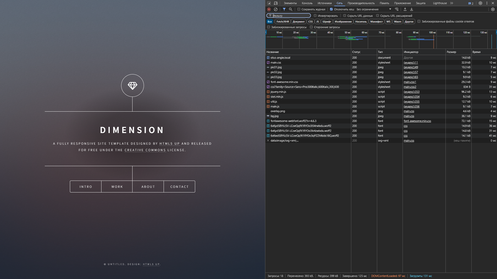
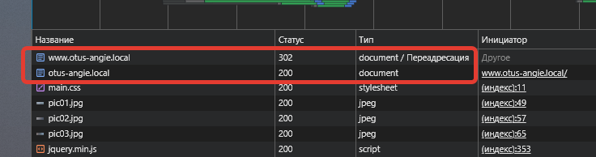

# Angie как веб-сервер

Цель: Создать базовую конфигурацию для работы статического сайта с разделением location.

Все манипуляции производятся на виртуальной машине с ОС ALT Server:

```
# lsb_release -a
LSB Version:    5.0:core-3.0-amd64:core-3.0-noarch:core-5.0-amd64:core-5.0-noarch
Distributor ID: ALT
Description:    ALT Server 10.2 (Mendelevium)
Release:        10.2
Codename:       Mendelevium

# angie -v
Angie version: Angie/1.7.0
```

Получаем архив с сайтом.

```bash
 wget https://cdn.otus.ru/media/public/96/c1/static_site-252831-96c1e2.zip
 ```

Распакуем архив в папку `/var/www/static-site` и изменим владельца и группу на `angie`.

```bash
sudo mkdir /var/www
sudo unzip static_site-252831-96c1e2.zip -d /var/www/static-site
sudo chown -R angie:angie /var/www/
```

В папке `/etc/angie/http.d` создадим файл `static-site.conf` следующего содержания.

```nginx
server {
    listen 88;

    location / {
        root /var/www/static-site;
        index index.html;
    }
}
```

Проверяем конфиг и в случае успеха загружваем его.

```bash
angie -t && service angie reload
```

В результате, мы имеем работающий сайт на 88 порту.

```bash
$ curl -I localhost:88
HTTP/1.1 200 OK
Server: Angie/1.7.0
Date: Sun, 13 Oct 2024 10:35:19 GMT
Content-Type: text/html
Content-Length: 14532
Last-Modified: Fri, 06 Sep 2024 16:10:23 GMT
Connection: keep-alive
ETag: "66db296f-38c4"
Accept-Ranges: bytes
```

Чтобы на тестовом стенде можно было обращаться к сайту по имени, добавим на рабочем компьютере в файл `hosts` строку:

```
192.168.55.220  otus-angie.local www.otus-angie.local
```

И изменим начало нашего конфига:

```nginx
    .....
    listen 80;
    server_name otus-angie.local;
    .....
```

Теперь сайт работает на 80 порту и доступен с рабочего компьютера по адресу <http://otus-angie.local> (www.otus-angie.local мы задействуем позже). 



Продолжим издеваться над конфигурацией...

Добавим в `/etc/angie/angie.conf` директиву `map`:

```nginx
map $msie $cache_control {
    default "max-age=31536000, public, no-transform, immutable";
    "1"     "max-age=31536000, private, no-transform, immutable";
}
```

Чтобы не писать каждый раз путь к сайту, создадим переменную `$root_path`.

Добавим location для папок `assets`, `error` и `images`,
в каждый location добавим строки:

```
        add_header Cache-Control $cache_control;
        root $root_path;
```

> Вообще, во всех location у нас одинаковый `root` и его можно было бы определить на уровне server.

> Правильнее было бы вынести `add_header Cache-Control...` в файл `/etc/angie/static.conf` и сделать include, поскольку для общей настройки статики может быть несколько директив...  

Добавим location c регулярным выражением для отдачи картинок и, к примеру, защитим их от HotLinking:

```nginx
location ~* \.(jpg|jpeg|png|gif)$ {
    root $root_path;
    valid_referers none blocked otus-angie.local;
    if ($invalid_referer) {
        return 403;
    }
}
```

> Что-то мне подсказывает, что location '/images' теряет смысл, так как кроме картинок у нас там ничего нет, а location с регулярным выражением имеет более высокий приоритет, чем location без модификатора.  
> Если же поднять ему приоритет модификатором - перестанет работать location c регулярным выражением.

Сделаем перенаправление с домена с www на без www.  
Для этого добавим ещё один блок server следующего вида:

```nginx
server {
    listen 80;
    server_name www.otus-angie.local;
    return 302 $scheme://otus-angie.local$request_uri;
}
```

В результате при заходе по адресу www.otus-angie.local получаем постоянную переадресацию на домен без www.



В принципе, вместо `return 302 ...` можно было использовать `rewrite`:

```nginx
rewrite ^(.*) http://otus-angie.local$1 permanent;
```

Но return предпочтительнее, потому что он проще и быстрее (сервер прекращает обработку запроса и ему не нужно обрабатывать регулярное выражение).

Добавим обработку ошибки 404, ведь у нас есть красивая страница `/error/index.html`! Сделать это можно несколькими способами. Например, в директиве `try_files`:

```nginx
location / {
    ......
    try_files $uri $uri/ /error/index.html;
    .....
}
```

или директивой `error_page` (мне нравится больше):

```
error_page 404 /error/index.html;
```

Итоговую конфигурацию [static-site.conf](static-site.conf) я позволил себе немного оптимизировать, убрав «лишние» директивы и переменные.
