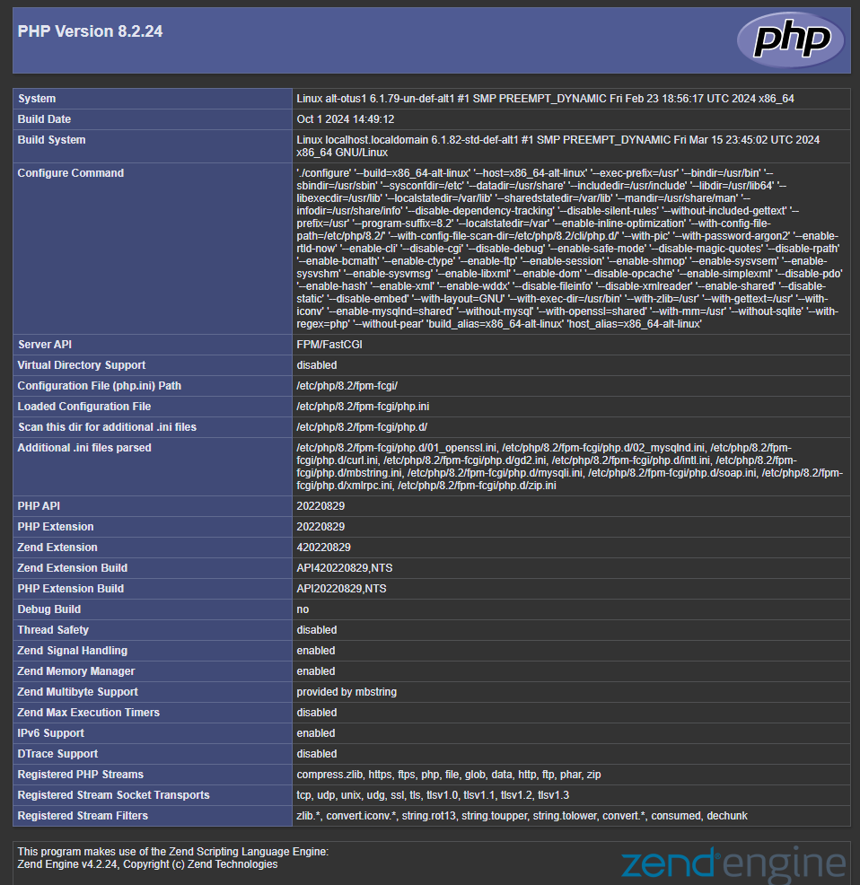
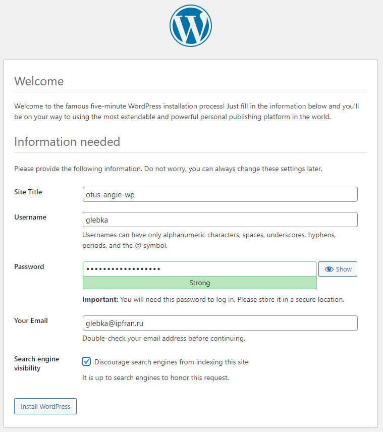
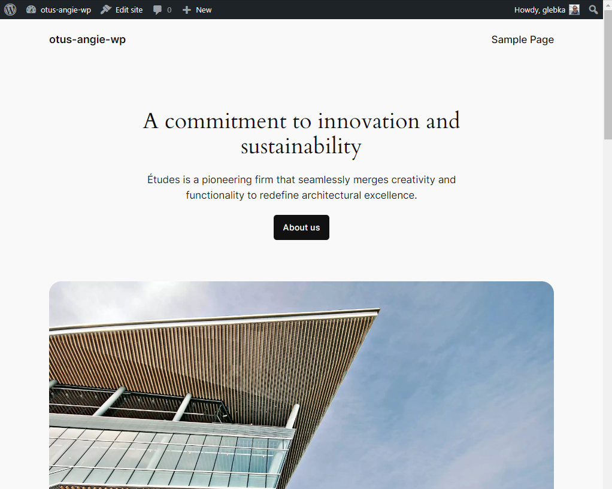

# Запуск сайта с CMS WordPress

Цель: Запустить рабочую систему управления сайтами (CMS). Изучить на практике Angie/Nginx как обратный прокси.

Дополнительная цель: в связи с производственной необходимостью сделать это всё под Alt Linux, где всё немного не так... )))

Все манипуляции производятся на виртуальной машине с ОС ALT Server с установленным ранее Angie 1.7.0:

```
# lsb_release -a
LSB Version:    5.0:core-3.0-amd64:core-3.0-noarch:core-5.0-amd64:core-5.0-noarch
Distributor ID: ALT
Description:    ALT Server 10.2 (Mendelevium)
Release:        10.2
Codename:       Mendelevium

# angie -v
Angie version: Angie/1.7.0
```

## Установка и подготовка MariaDB

Установим, добавим в автозагрузку и запустим MariaDB:

```
# apt-get install mariadb
# systemctl enable --now mariadb.service
```

Выполним начальную настройку безопасности (создадим пароль для root, отключим ему удалённый вход, удалим анонимные учётные записи и удалим тестовые базы):

```
# mysql_secure_installation
```

Создадим базу `wp`, добавим пользователя `wpuser` и дадим ему права:

```
$ mariadb -u root -p
> create database wp;
> grant all privileges on wp.* to 'wpuser'@'%' identified by '.........';
> exit
```

## Установка PHP

Установим PHP, запустим и добавим в автозагрузку php8.2-fpm, проверим версию:

```
# apt-get install php8.2-fpm-fcgi php8.2-curl php8.2-mysqli php8.2-gd php8.2-intl php8.2-mbstring php8.2-soap php8.2-xml php8.2-xmlrpc php8.2-zip
# systemctl enable --now php8.2-fpm
# php -v
PHP 8.2.24 (cli) (built: Oct  1 2024 14:49:12) (NTS)
Copyright (c) The PHP Group
Zend Engine v4.2.24, Copyright (c) Zend Technologies
.........
```

Проверим наши процессы:

```
# ps afx
.............
   5340 ?        Ss     0:00 angie: master process v1.7.0 #6 [/usr/sbin/angie -c /etc/angie/angie.conf]
   8174 ?        S      0:00  \_ angie: worker process #6
   8175 ?        S      0:00  \_ angie: worker process #6
   7240 ?        Ssl    0:04 /usr/sbin/mysqld
   7967 ?        Ss     0:01 php8.2-fpm: master process (/etc/fpm8.2/php-fpm.conf)
  10047 ?        S      0:05  \_ php8.2-fpm: pool www
  10094 ?        S      0:03  \_ php8.2-fpm: pool www
  10096 ?        S      0:02  \_ php8.2-fpm: pool www
.............
```

Добавим пользователя `angie` в группу `_webserver` (иначе получим Permission denied при работе с сокетом `unix:/var/run/php8.2-fpm/php8.2-fpm.sock`):

```
# usermod -a -G _webserver angie
```

Создадим файл `/etc/angie/http.d/wp.conf`:

```nginx
server {
    listen 88;

    root /var/www/test;

    location / {
        try_files $uri $uri/ =404;
    }

    location ~ \.php$ {
        include /etc/angie/fastcgi.conf;
        fastcgi_pass unix:/var/run/php8.2-fpm/php8.2-fpm.sock;
    }
}
```

Создадим файл `/var/www/test/test.php`:

```php
<?php phpinfo(); ?>
```

Проверим и перечитаем конфиг angie:

```
# angie -t && angie -s reload
```

Проверим:

```
# curl -I localhost:88/test.php
HTTP/1.1 200 OK
Server: Angie/1.7.0
Date: Sun, 13 Oct 2024 03:49:21 GMT
Content-Type: text/html; charset=UTF-8
Connection: keep-alive
X-Powered-By: PHP/8.2.24
```

При заходе браузером получаем страницу информации о текущей конфигурации PHP:



PHP работает!

## Установка WordPress

Скачаем последнюю версию WordPress, распакуем в папку `/var/www`.

```bash
curl -LO https://wordpress.org/latest.tar.gz
sudo tar -xf latest.tar.gz -C /var/www
```

Cкопируем `/var/www/wordpress/wp-config-sample.php` в `/var/www/wordpress/wp-config.php` и пропишем в нём нашу базу, пользователя и его пароль, которые мы создали при установке MariaDB.

Приведём файл `/etc/angie/http.d/wp.conf` к следующему виду (otus-angie.local прописан у нас в hosts в предыдущем ДЗ):

```nginx
server {
    listen  80;
    server_name otus-angie.local;

    root /var/www/wordpress;
    index index.html index.php;

    location ~ /\. {
        deny all;
    }

    location ~ ^/wp-content/cache {
        deny all;
    }

    location ~* /(?:uploads|files)/.*\.php$ {
        deny all;
    }

    location / {
        try_files $uri $uri/ /index.php?$args;
    }

    location /wp-content {
        add_header Cache-Control "max-age=31536000, public, no-transform, immutable";
    }

    location ~* \.(css|gif|ico|jpeg|jpg|js|png)$ {
        add_header Cache-Control "max-age=31536000, public, no-transform, immutable";
    }

    location ~ \.php$ {
        include /etc/angie/fastcgi.conf;
        fastcgi_pass unix:/var/run/php8.2-fpm/php8.2-fpm.sock;
    }

    access_log /var/log/angie/otus-angie-access.log;
}
```

Открываем в браузере [otus-angie.local](http://otus-angie.local) и попадаем на страницу Установки WordPress.



После всех манипуляций входим и попадаем на служебную страницу.


Также работает публичная часть сайта.


