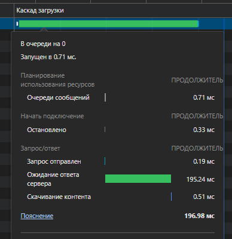
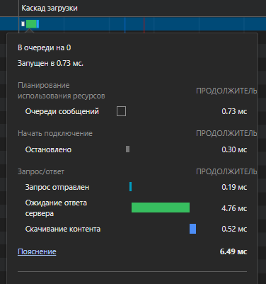
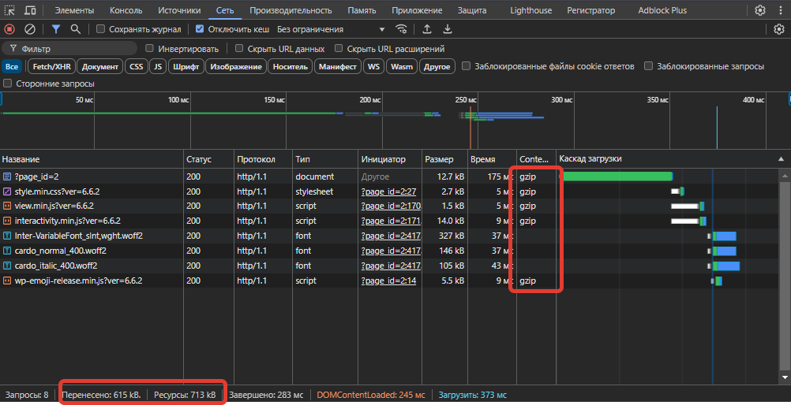
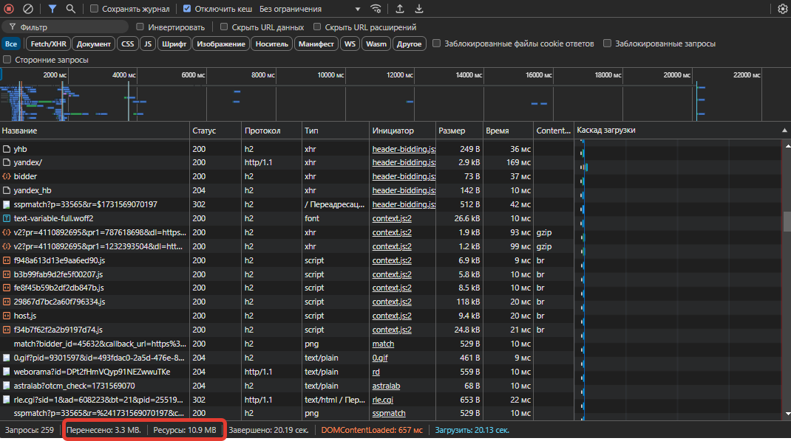
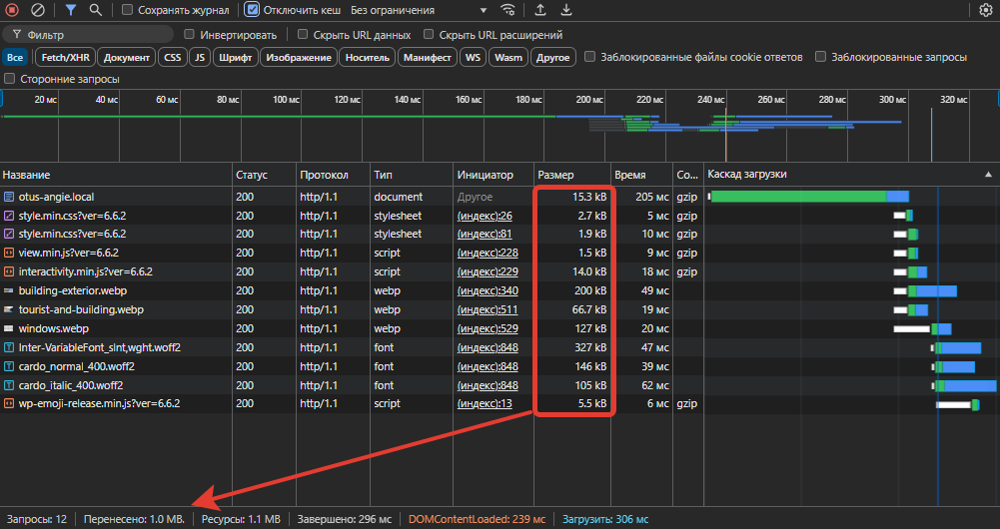
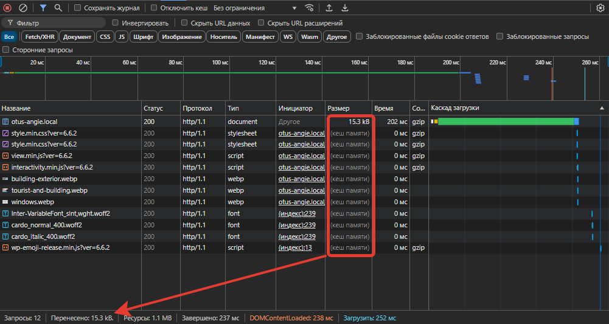

# Оптимизация WordPress

Цель: Оптимизировать конфигурацию сайта WordPress. Использовать приёмы клиентской и серверной оптимизации.

Все манипуляции производятся на виртуальной машине с ОС ALT Server с установленным в [предыдущем домашнем задании](../homework4/readme.md) WordPress.

Оптимизация веб-сервера — это процесс улучшения производительности и эффективности работы веб-сервера с точки зрения конечного пользователя. Это включает в себя оптимизацию как самого сервера, так и контента, который он доставляет клиенту.

Основные аспекты и методы клиентской оптимизации веб-сервера:

- Оптимизация контента (сжатие данных, минификация, оптимизация изображений, кэширование);
- Оптимизация сетевых запросов (HTTP/2 и HTTP/3, CDN, прелоадинг и префечинг);
- Оптимизация серверной инфраструктуры (балансировка нагрузки, кэширование на сервере, оптимизация базы данных);
- Оптимизация кода (асинхронная загрузка, ленивая загрузка, комбинирование файлов).

## Серверное кэширование

Серверное кэширование используется для улучшения производительности веб-сайтов и приложений путем сохранения часто запрашиваемых данных в кэше на сервере. Это позволяет уменьшить нагрузку на сервер (например, медленный бэкенд) и сократить время отклика, так как данные могут быть быстро извлечены из кэша вместо того, чтобы каждый раз запрашиваться из базы данных или других источников.

Попробуем поиграть с серверным кэшированием.

Добавим в `angie.conf` в контекст `http` строки:

```nginx
proxy_cache_valid 1m;
proxy_cache_key $scheme$host$request_uri;
proxy_cache_path /var/www/cache levels=1:2 keys_zone=one:10m inactive=48h max_size=800m;
```

Добавим  в `location /`  нашего сервера строки:

```nginx
proxy_cache one;
proxy_cache_valid 200 1h;
proxy_cache_lock on;
proxy_cache_min_uses 2;
proxy_ignore_headers "Cache-Control" "Expires";
proxy_cache_use_stale updating error timeout invalid_header http_500 http_502 http_504;
proxy_cache_background_update on;
```

Проверим и перечитаем конфиг angie:

```
# angie -t && angie -s reload
```
Ничего не сломалось, но и особых изменений в работе сайта не обнаружилось.
Похоже, на текущей конфигурации proxy_cache работать не может, скорее всего ему требуется proxy_pass.

Мне удалось настроить серверное кэширование в другом месте, где Angie используется как реверс-прокси, что позволило уменьшить время ожидания ответа сервера с сотен милисекунд до нескольких.

Location на реверс-прокси следующий:

```
location / {
    proxy_cache cache_zone;
    proxy_cache_valid 200 1h;
    proxy_cache_lock on;
    proxy_cache_min_uses 2;
    proxy_ignore_headers "Cache-Control" "Expires";
    proxy_cache_use_stale updating error timeout invalid_header http_500 http_502 http_504;
    proxy_cache_background_update on;

    proxy_set_header Host $host;
    proxy_set_header X-Real-IP $remote_addr;
    proxy_set_header X-Forwarded-For $proxy_add_x_forwarded_for;
    proxy_redirect http:// $scheme://;
    proxy_pass http://192.168.22.22:5000/;
}
```

Без серверного кэша:



С серверным кэшем:




## Клиентская оптимизация

### Сжатие текстовых ресурсов

Поскольку в текущей конфигурации мы используем HTTP, нет смысоа настраивать что-то иное кроме gzip.

Добавим в `angie.conf` в контекст `http` строки:

```nginx
gzip  on;
gzip_static on;
gzip_types text/plain text/css text/xml application/javascript application/json image/svg+xml application/font-ttf;
gzip_comp_level 5;
gzip_proxied any;
gzip_min_length 1000;
gzip_vary on;
```
Видим уменьшение трафика:



Вообще, пустой WordPress не самый интересный сайт для таких тестов. Гораздо интереснее посмотреть большую статью на каком-нибудь ixbt.com или habr.com. Там выигрыш в передаче сжатых данных гораздо заметнее.



### Кэширование на клиенте

Кэширование папки `/wp-content` и файлов .css, .gif, .ico, .jpeg, .jpg ,.js и .png было сделано ещё в прошлый раз, но мы сделаем вид, что сделали это сейчас.

Добавим в наш сервер два location:

```nginx
location /wp-content {
    add_header Cache-Control "max-age=31536000, public, no-transform, immutable";
}

location ~* \.(css|gif|ico|jpeg|jpg|js|png)$ {
    add_header Cache-Control "max-age=31536000, public, no-transform, immutable";
}
```

Кэширование на клиенте значительно уменьшает объём передаваемого трафика, чем значительно уменьшает время отклика страницы.

Без кэша:



С кэшем на клиенте:


