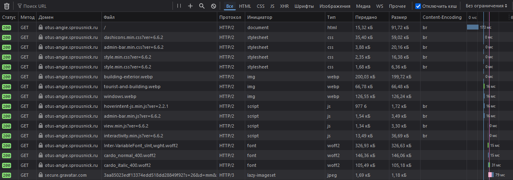
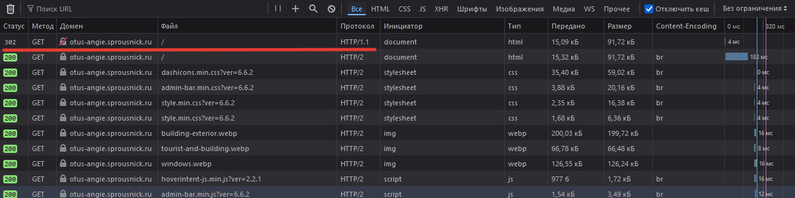
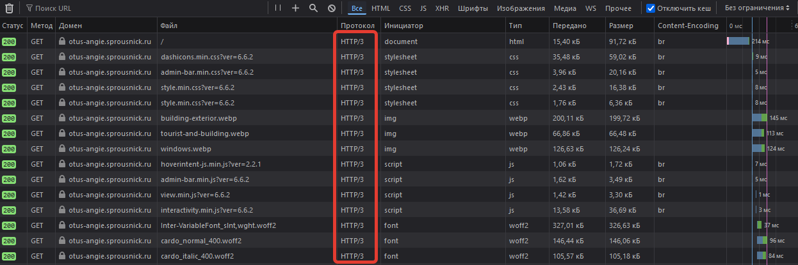
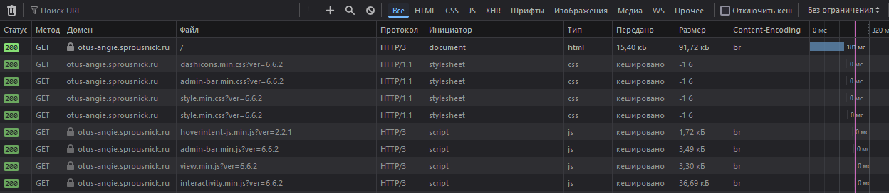
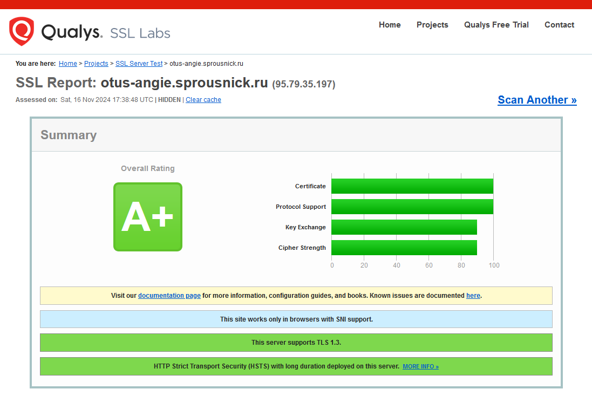

# Настройка HTTPS

Цель: Настроить эффективную и безопасную конфигурацию для HTTPS.

Исходя из учёта имеющихся ресурсов выбрана схема с SSL-терминацией.
Имеем:
- виртуальная машина Debian 12 с Angie 1.7.0 на которую через интернет-шлюз проброшены порты TCP:80 и TCP/UDP:443;
- виртуальная машина Alt Server 10.4 c Angie 1.7.0 и сайтом Wordpress, который мы подняли в предыдущих домашних заданиях;
- домен sprousnick.ru с соответствующей A-записью и CNAME otus-angie.sprousnick.ru.

## Подготовка

Удостоверимся, что домен существует и резолвится куда надо:

```
# nslookup otus-angie.sprousnick.ru
........
Non-authoritative answer:
otus-angie.sprousnick.ru        canonical name = sprousnick.ru.
Name:   sprousnick.ru
Address: 95.79.35.197
```

Для получения сертификатов будем использовать ACME-модуль, который уже включен в сборку Angie. Наличие модуля можно проверить командой `angie -V`. Заодно там же узнаем версию OpenSSL.

Удостоверимся, что в `/etc/angie/angie.conf` в контексте `http` прописан `resolver`.

В каталоге `/etc/angie` создадим файл `dhparam.pem`:

```
# openssl dhparam -out dhparam.pem 4096
```

В каталоге `/etc/angie/snippets` создадим файл `ssl-intermediate.conf` (значения параметров подсмотрели на [ssl-config.mozilla.org](https://ssl-config.mozilla.org/)):

```nginx
ssl_protocols TLSv1.2 TLSv1.3;
ssl_ciphers ECDHE-ECDSA-AES128-GCM-SHA256:ECDHE-RSA-AES128-GCM-SHA256:ECDHE-ECDSA-AES256-GCM-SHA384:ECDHE-RSA-AES256-GCM-SHA384:ECDHE-ECDSA-CHACHA20-POLY1305:ECDHE-RSA-CHACHA20-POLY1305:DHE-RSA-AES128-GCM-SHA256:DHE-RSA-AES256-GCM-SHA384:DHE-RSA-CHACHA20-POLY1305;
ssl_prefer_server_ciphers off;
ssl_dhparam /etc/angie/dhparam.pem;
ssl_session_timeout 1d;
ssl_session_cache shared:MozSSL:10m;
```

## Сертификаты и HTTP/2

На реверс-прокси создадим конфиг `otus-angie.conf` следующего вида:

```nginx
acme_client otus_angie_rsa   https://acme-v02.api.letsencrypt.org/directory key_type=rsa;
acme_client otus_angie_ecdsa https://acme-v02.api.letsencrypt.org/directory;

server {
    listen 443 ssl;
    server_name otus-angie.sprousnick.ru;
    http2 on;

    acme otus_angie_rsa;
    acme otus_angie_ecdsa;
    ssl_certificate     $acme_cert_otus_angie_rsa;
    ssl_certificate_key $acme_cert_key_otus_angie_rsa;
    ssl_certificate     $acme_cert_otus_angie_ecdsa;
    ssl_certificate_key $acme_cert_key_otus_angie_ecdsa;
    include /etc/angie/snippets/ssl-intermediate.conf;

    location / {
        proxy_pass http://192.168.55.220;
        proxy_http_version  1.1;

        proxy_set_header Upgrade           $http_upgrade;
        proxy_set_header Connection        keep-alive;
        proxy_set_header Host              $host;
        proxy_set_header X-Real-IP         $remote_addr;
        proxy_set_header X-Forwarded-For   $proxy_add_x_forwarded_for;
        proxy_set_header X-Forwarded-Proto $scheme;
        proxy_set_header X-Forwarded-Host  $host;
        proxy_set_header X-Forwarded-Port  $server_port;
    }
}
```

Директивы `acme_client` находится в контексте `http`.

В директиве `listen` не прописан `reuseport`, поскольку уже прописан в другом месте.

192.168.55.220 - виртуальная машина с WordPress, где в `server_name` надо не забыть добавить наш домен.

> Так же не забываем в настройках WordPress заранее поменять WordPress Address (URL) и Site Address (URL) на https://otus-angie.sprousnick.ru.

Проверим и перечитаем на реверс-прокси конфиг Angie:

```
# angie -t && angie -s reload
```

В журнале `/var/log/angie/error.log` видим записи о создании сертификатов (похоже, сертификаты создаются в момент проверки конфигурации, это надо учитывать при тестах, чтобы не поймать бан на LE).

```log
........
2024/11/16 18:46:46 [notice] 104466#104466: no certificate, renewal scheduled now, ACME client: otus_angie_rsa
2024/11/16 18:46:46 [notice] 104466#104466: no certificate, renewal scheduled now, ACME client: otus_angie_ecdsa
........
```

В каталоге `/var/lib/angie/acme` появились каталоги `otus_angie_ecdsa` и `otus_angie_rsa` с файлами `account.key`, `certificate.pem` и `private.key` в каждом.

Зайдём на [сайт](https://otus-angie.sprousnick.ru/) и посмотрим что у нас там внутри. Видим протокол HTTP/2 и сжатие brotli. Красота:



Добавим переадресацию с HTTP на HTTPS. Для этого в конфиг добавим ещё одну секцию `server`:

```nginx
server {
    listen 80;
    server_name otus-angie.sprousnick.ru;
    return 302 https://otus-angie.sprousnick.ru$request_uri;
}
```

Проверяем. Работает:



Для повышения безопасности используем HTTP Strict Transport Security (HSTS) — механизм, активирующий форсированное защищённое соединение по HTTPS. Данная политика безопасности позволяет сразу же устанавливать безопасное соединение, вместо использования HTTP, что позволяет обезопасить себя от атак «man-in-the-middle».  
Для этого добавим в конфигурацию сайта заголовок `Strict-Transport-Security`:

```nginx
add_header Strict-Transport-Security max-age=31536000;
```

После первого захода на сайт и последующей попытке зайти по http у нас пропала первая строка как на скриншоте выше, т.е. браузер сразу использует https.

Попробуем добавить HTTP/3. Ситуация отягощена тем, что наш сайт не единственный на реверс-прокси и потребуются дополнительные телодвижения для достижения результата.

Добавим в секцию `server` следующие строки:

```nginx
listen 443 quic;
http3 on;
```

Директива `listen` снова без `reuseport`, поскольку уже есть в другом месте.

Так же в `location` добавим заголовки:

```nginx
add_header Alt-Svc 'h3=":443"; ma=86400';
add_header x-quic 'h3';
add_header Alt-Svc 'h3-29=":443"';
```

Вычитал, что второй и третий заголовки требуются для мультидоменной конфигурации сервера.

Проверяем. Все получилось.



И та же страница, но с включеным кэшем на клиенте:



Прилагаю итоговую конфигурацию [otus-angie.conf](otus-angie.conf).

## Проверка

Тест SSL Labs показал положительный результат:



Из предупреждений мы имеем:

- сайт работает только с современными браузерами с поддерждкой SNI (ну и хорошо);
- на DNS нет CAA-записи (надо сделать что ли...);
- и непонятный пункт `Session resumption (caching): No (IDs assigned but not accepted)` (надеюсь, ничего серьёзного).
