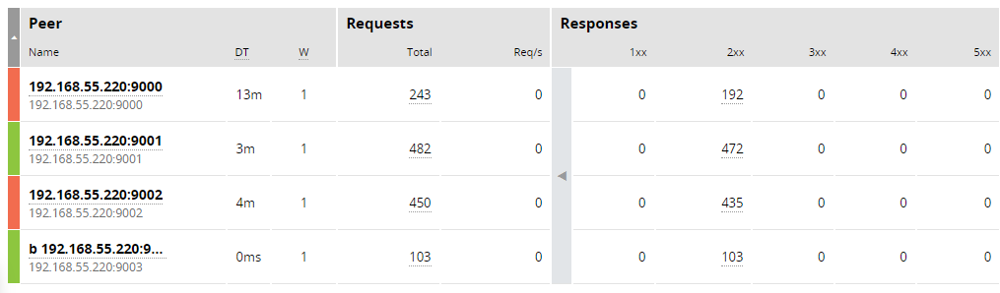

# Балансировка HTTP

Цель: настроить схему балансировки на уровне HTTP.

Как и в предыдущем задании будем использовать схему: реверс прокси с SSL-терминацией + сервер приложений.  
По-прежнему для доступа из сети интернет будем использовать адрес [otus-angie.sprousnick.ru](https://otus-angie.sprousnick.ru).  
После проверки домашнего задания сервер будет погашен.

## Подготовка сервера приложений

Изначально у нас есть чистая установка Alt Server 10.4.

Установим `docker-compose` и поднимем несколько контейнеров с `vscoder/webdebugger`.

Ставим Докер, загружаем образ:

```bash
apt-get update
apt-get dist-upgrade -y
apt-get install -y docker-io docker-compose
systemctl enable --now docker
docker pull vscoder/webdebugger:latest
```

Используем файл [docker-compose.yml](docker-compose.yml) чтобы поднять четыре контейнера с индивидуальными настройками:

```bash
docker compose up -d
```


## Настройка балансировки

За основу возьмём [рабочий конфиг](../homework6/otus-angie.conf) из предыдущего домашнего задания.

### Равномерная балансировка (round robin)

Добавим секцию `upstream` с нашими бэкендами, и заменим `proxy_pass` на наш апстрим:

```nginx
upstream otus_angie {
    zone upstream-backend 256k;
    server 192.168.55.220:9000 sid=white;
    server 192.168.55.220:9001 sid=blue;
    server 192.168.55.220:9002 sid=green;
    server 192.168.55.220:9003 sid=cyan;
}

server {
    ......
    location / {
        ......
        proxy_pass http://otus_angie;
        ......
    }
    ......
}
```

Полный результат представлен в файле [otus-angie-rr.conf](otus-angie-rr.conf).

Заходим по адресу [otus-angie.sprousnick.ru](otus-angie.sprousnick.ru) и убеждаемся в последовательной смене цветов при каждом запросе. 

Также последовательный рост счётчика запросов можно увидеть в консоли Angie:


### Балансировка по хэшу с использованием переменных

Добавим в секцию `upstream` строку:

```nginx
......
hash $scheme$request_uri;
......
```

Полный результат представлен в файле [otus-angie-hash.conf](otus-angie-hash.conf).

Убедимся, что мы попадаем на разные бэкенды в зависимости от строки запроса:

- https://otus-angie.sprousnick.ru/ - white
- https://otus-angie.sprousnick.ru/about - blue
- https://otus-angie.sprousnick.ru/history - white
- https://otus-angie.sprousnick.ru/news - cyan
- https://otus-angie.sprousnick.ru/page-1 - green

### Произвольная балансировка (random)

Снова изменим секцию `upstream` (вмсто строки `hash ...` напишем `random`).

Полный результат представлен в файле [otus-angie-random.conf](otus-angie-random.conf).

Наблюдаем в консоли случайное распределение запросов:


## Резервный бэкенд и отключение бэкендов

Параметр backup нельзя использовать совместно с методами балансировки нагрузки hash, ip_hash и random, поэтому вернём конфигурацию Round Robin и назначим последний (cyan) бэкенд резервным:

```nginx
......
server 192.168.55.220:9003 sid=cyan backup;
......
```

Видим, что сервер помечен как резервный и запросы на него не поступают:


Попробуем погасить один их основных бэкендов:

```bash
docker stop debug-white
```

В консоли видим первый сервер в состоянии Failed, запросы продолжают идти к двум оставшимся серверам:


Погасим остальные два бэкенда:

```bash
docker stop debug-blue
docker stop debug-green
```

Резервный сервер включился в работу, запросы пошли на него.


Вернём обратно один из серверов:

```bash
 docker start debug-blue
```

Резервный сервер снова не задействован, все запросы пошли на второй бэкенд:


