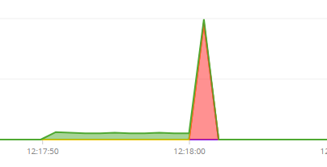
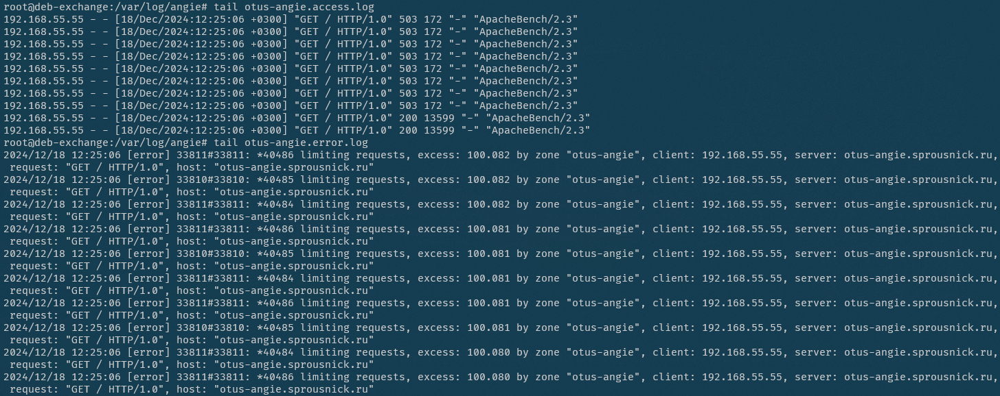
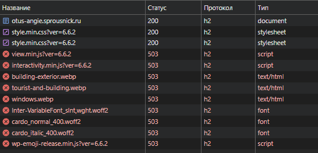
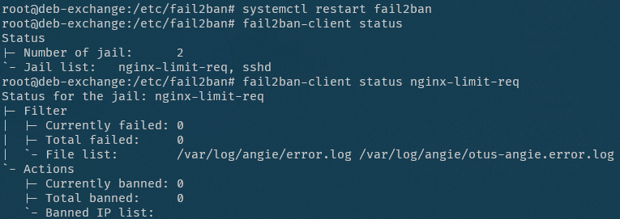
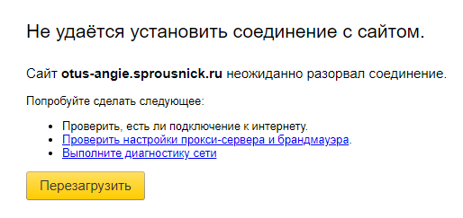
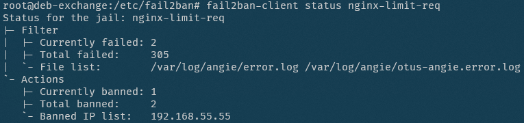
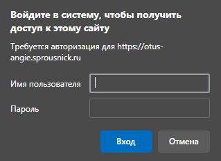
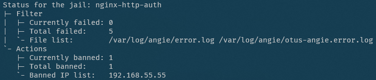

# Защита от DoS-атак, ограничение доступа

Цель: Применить известные методы защиты от DoS-атак на приложение.

Задействуем ресурсы, которые были подготовлены в [домашнем заданиии 6](/homework6/readme.md):
- виртуальная машина Debian 12 с Angie 1.7.0 на которую через интернет-шлюз проброшены порты TCP:80 и TCP/UDP:443;
- виртуальная машина Alt Server 10.4 c Angie 1.7.0 и сайтом Wordpress, который мы подняли в предыдущих домашних заданиях;
- домен sprousnick.ru с соответствующей A-записью и CNAME otus-angie.sprousnick.ru.

Все действия будем производить на первой ВМ.

## Ограничение частоты запросов

Попробуем ограничивать скорость обработки запросов, поступающих с одного IP-адреса методом "leaky bucket".

Для этого в контексте `http` зададим зону разделяемой памяти `otus-angie` размером 10 мегабайт и средней скоростью обработки 1 запрос в секунду (маловато, но мы же экспериментируем):

```nginx
...
limit_req_zone $binary_remote_addr zone=otus-angie:10m rate=1r/s;
...
```

А в контекст `server` добавим зону `otus-angie` с максимальным всплеском 100 без задержки запросов и отдельные журналы, чтобы было проще разбираться:

```nginx
...
limit_req zone=otus-angie burst=100 nodelay;
...
access_log /var/log/angie/otus-angie.access.log;
error_log  /var/log/angie/otus-angie.error.log;
...
```

Проверим:

```bash
ab -n 300 -c 5 -l -k -H "Accept-Encoding: gzip,deflate,br" https://otus-angie.sprousnick.ru/
```

На графике в консоли видим, как начинают выполняться запросы, а по достижении значения всплеска запросы отклоняются.



В `otus-angie.access.log` видим ошибки с кодом 503 (по-умолчанию код ответа 503, другой можно задать директивой `limit_req_status`).  
В `otus-angie.error.log` видим записи об ограничении запросов с нашего адреса.



Если уменьшить burst до 5 и посмотреть в браузере что происходит мы увидим, что под раздачу попадает не только PHP-бэкенд, но и статика (стили, скрипты, картинки), в результате чего страница сайта загружается, но выглядит и работает не так как задумано.



Поскольку мы не хотим блокировать весь сайт, настроим защиту для защиту для страницы `/wp-login.php`

Для этого создадим ещё один `location`:

```nginx
...
location ~* wp\-login\.php {
    limit_req  zone=otus-angie burst=1 nodelay;
    ...
}
...
```
В результе, у нас ограничена частота запросов только к [странице входа](https://otus-angie.sprousnick.ru/wp-login.php).

## fail2ban

Добавим автоматическую блокировку атакующих сервисом fail2ban.

Сервис fail2ban на сервере уже был установлен, но использовался только для защиты SSH.

Добавим в конфиг `/etc/fail2ban/jail.local` секцию:

```ini
[nginx-limit-req]
port     = http,https
enabled  = true
filter   = nginx-limit-req
action   = iptables-multiport[name=ReqLimit, port="http,https", protocol=tcp]
logpath  = /var/log/angie/*error.log
findtime = 600
bantime  = 7200
maxretry = 4
```

Перезапустим и проверим статус:



Никто не забанен.

Попробуем в браузере несколько раз быстро обратиться к `/wp-login.php`. В результате сначала несколько раз получаем ошибку 503, а потом и отсутствие соединения.



Статус fail2ban показывает заблокированный IP.



## Аутентификация и ограничение доступа

Добавим (для эксперимента!) в наш сервер консоль Angie и закроем к ней доступ отовсюду, кроме нашей локальной сети:

```nginx
...
location /console {
    allow 192.168.55.0/24;
    deny all;

    alias /usr/share/angie-console-light/html;
    index index.html;

    location /console/api/ {
        api /status/;
    }
}
...
```

Так, при заходе с внешнего адреса, мы получаем 403 Forbidden.

Закроем дополнительно консоль паролем, чтобы и из локальной сети не заходил кто попало.

Создадим юзера `consoleuser` (требуется пакет `apache2-utils`):

```bash
htpasswd -c /etc/angie/htpasswd consoleuser
```

Добавим в `location /console` строки:

```nginx
auth_basic "Вход только для своих!";
auth_basic_user_file /etc/angie/htpasswd;
```

При заходе по адресу [/console](https://otus-angie.sprousnick.ru/console) видим окно входа.



В случае отказа получаем 401 Unauthorized.
В случае неверного пользователя и/или пароля снова получаем окно входа.

Для защиты от подбора пароля есть смысл  настроить fail2ban, поэтому в `/etc/fail2ban/jail.local` добавим:

```ini
[nginx-http-auth]
enabled = true
port    = http,https
logpath = /var/log/angie/*error.log
bantime = 7200
```

Перезапустим службу fail2ban и попробуем несколько раз зайти с неправильным паролем или несуществующим пользователем.

Адрес заблокирован:


